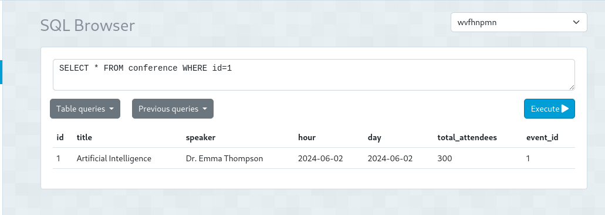
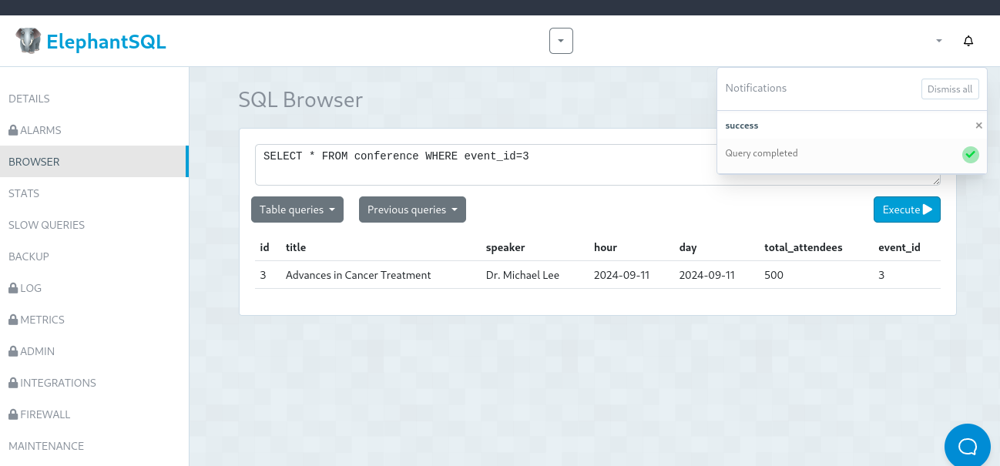
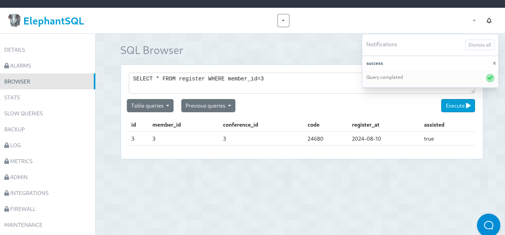
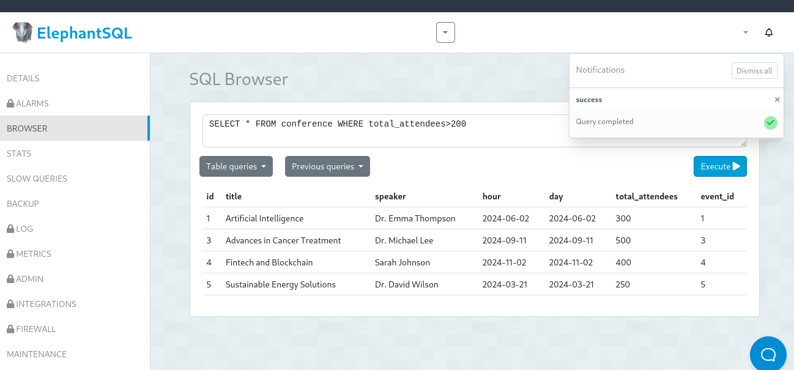
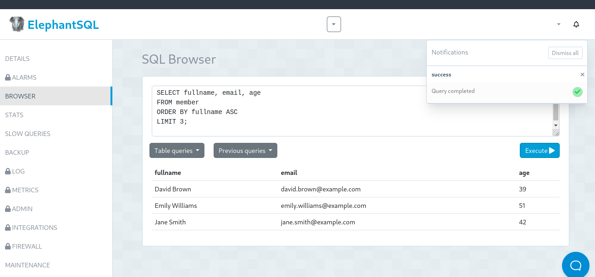

# Deber de Base de Datos

by: Calle Alex

## Objetivo

***Generar 5 consultas con SELECT aplicando condicionales con WHERE y ORDER BY.***

### 1. Listar la primera conferencia

adjunta: 

### 2. Listar el tercer evento de la conferencia

adjunta: 

### 3. Listar los registros donde el id del miembro sea 3

adjunta: 

### 4. Listar las conferencias donde hayan mas de 200 participantes

adjunta: 

### 5. Listar los nombres, email y edad de los miembros ordenados alfabeticamente

adjunta: 
